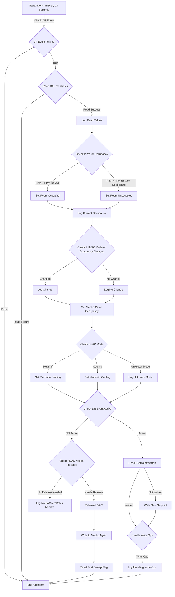

# Running a BACnet server inside the building on OT LAN as a Service on linux edge device using systemd

Tested on `SIMPLE_SIGNAL` a value of `0` for normal operationss and a value of `1` for demand response `True`. Start off by updating `constants.py` with text editor for the cloud based demand response server (DR):

```python
# DR Server Setup
DR_SERVER_URL = "http://localhost:5000/payload/current"
USE_DR_SERVER = False
SERVER_CHECK_IN_SECONDS = 10

```
* `DR_SERVER_URL` is the cloud based demand response app that is used to get and change the DR signal sent to the buildings.

Setup:
```bash
python -m pip install bacpypes3 aiohttp ifaddr
```

Test script and use args to set BACnet device name and instance ID that comes by default with bacpypes3:
```bash
python adr_client.py --name Slipstream --instance 3056672
```

If a different UDP port is required for the project use an arg like: `--address 192.168.13.14/24:47820`

## Algorithm Method in `main.py` needs to be customized for your application



## Linux service notes

1. **Create a Service Unit File**

   Open a terminal on your Raspberry Pi and navigate to the systemd service unit directory:

   ```bash
   cd /etc/systemd/system

   sudo nano adr_client.service
   ```

2. **Add the Service Configuration** - Make sure you modify the field `User=your_username` and the correct `WorkingDirectory` fields

   ```bash
   [Unit]
   Description=BACnet Server
   After=network.target

   [Service]
   User=your_username
   WorkingDirectory=/home/your_username/bacnet-demand-response-client-server/building_adr_client
   ExecStart=/usr/bin/python3 adr_client.py --name Slipstream --instance 3056672 --debug
   Restart=always

   [Install]
   WantedBy=multi-user.target
   ```
   Replace `your_username` with your actual username.

2. **Save and Exit the Text Editor**
   After adding the configuration, save the file and exit the text editor.

3. **Enable and Start the Service**
   Enable the service to start on boot:
   ```bash
   sudo systemctl enable adr_client.service
   ```
   Then, start the service:
   ```bash
   sudo systemctl start adr_client.service
   ```
4. **Check the Service Status**
   Check the status of your service to ensure it's running without errors:
   ```bash
   sudo systemctl status adr_client.service
   ```
5. **If errors and need to update script**
   If you make changes to the script, stop the service to update it:
   ```bash
   sudo systemctl stop adr_client.service
   ```
6. **Start the Service After Updating**
   After making changes to the script, start the service again:
   ```bash
   sudo systemctl start adr_client.service
   ```
7. **Check the Updated Status**
   Check the status again to confirm that the updated script is running:
   ```bash
   sudo systemctl status adr_client.service
   ```

### **Reload Linux service if modifiations are required to the .py file and or Linux service**
   Reload the systemd configuration. This tells systemd to recognize your changes:
   ```bash
   sudo systemctl daemon-reload
   ```

   Restart your service to apply the changes:
   ```bash
   sudo systemctl restart adr_client.service
   ```

   Check the status to ensure it's running as expected:
   ```bash
   sudo systemctl status adr_client.service
   ```

   See debug print statements:
   ```bash
   sudo journalctl -u adr_client.service -f
   ```

# Troubleshooting

* See `tester.py` else use a [BACnet scanning tool](https://www.ccontrols.com/sd/bdt.htm) from another device on the OT LAN. The link is to a free tool which runs on Windows made by contemporary controls where the app and `demand-response-level` BACnet point should come up on analog input 1 as shown below:


